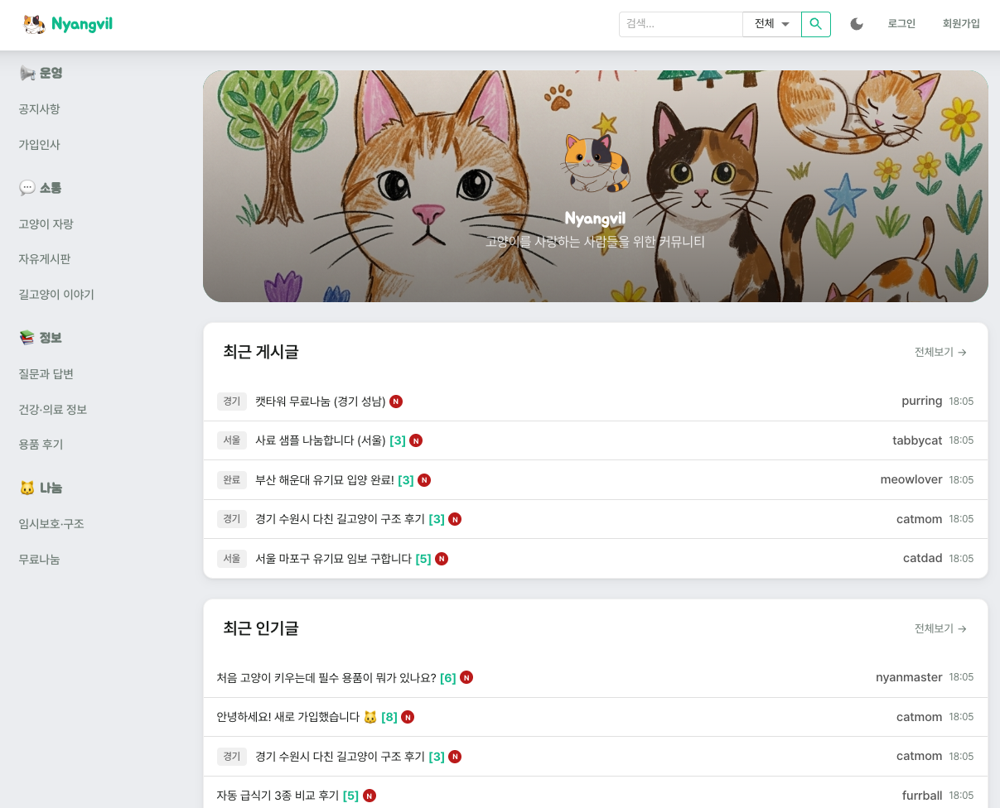
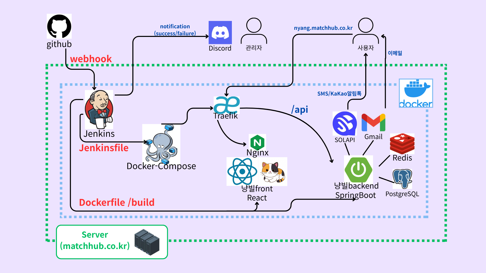
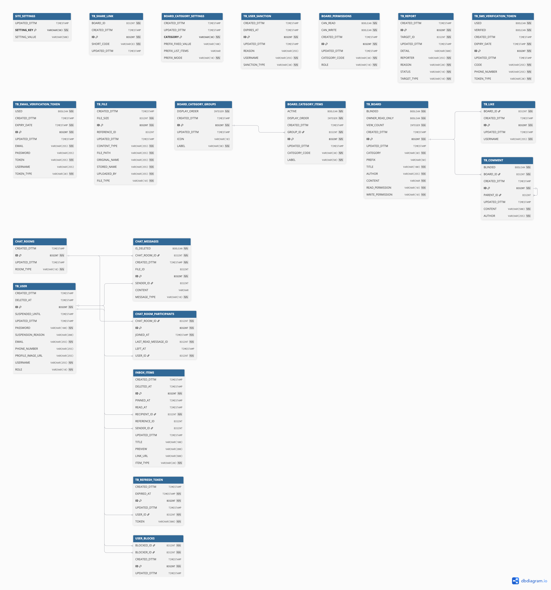

# 냥빌

고양이를 입양하길 원하는 사람들을 연결하는 커뮤니티 플랫폼    



[](https://nyang.matchhub.co.kr)
[](https://youtu.be/TulIOGhzlPU)

---

## 📑 Documentation

- 📋 **API 명세서** — [Notion](https://www.notion.so/Nyangvil-API-35d25730a3b080e3b72feb535aaa0afb)
- 🔧 **Swagger UI** — [바로가기](https://nyang.matchhub.co.kr/swagger-ui.html)

---

## 🏗️ 시스템 아키텍쳐

> 

---

## 📊 ERD

> 21개 테이블 · PostgreSQL · [인터랙티브 ERD 보기 (dbdiagram.io)](https://dbdiagram.io/d/6a02e3e47a923b947289f676)

[](https://dbdiagram.io/d/6a02e3e47a923b947289f676)

---

## ⚙️ 기술 스택

### Frontend

| 기술 | 버전 | 설명 |
|------|------|------|
| React | 19.2.5 | UI 프레임워크 |
| TypeScript | 6.0.2 | 정적 타입 |
| Vite | 8.0.10 | 빌드 도구 |
| MUI (Material-UI) | 9.0.0 | UI 컴포넌트 |
| Zustand | 5.0.12 | 상태 관리 |
| React Query | 5.100.9 | 서버 상태 관리 |
| React Hook Form + Zod | 7.75.0 / 4.4.3 | 폼 관리 + 유효성 검증 |
| Axios | 1.16.0 | HTTP 클라이언트 |
| STOMP.js + SockJS | 7.3.0 / 1.6.1 | WebSocket 클라이언트 |
| TipTap | 3.22.5 | 리치 텍스트 에디터 |
| Playwright | 1.59.1 | E2E 테스트 |

### Backend

| 기술 | 버전 | 설명 |
|------|------|------|
| Java | 21 | 언어 |
| Spring Boot | 3.4.5 | 프레임워크 |
| Spring Security | 6.x | 인증/인가 |
| Spring Data JPA | - | ORM |
| Spring WebSocket | - | 실시간 통신 |
| JWT (jjwt) | 0.12.6 | 토큰 인증 |
| springdoc-openapi | 2.8.8 | API 문서 자동 생성 |
| jsoup | 1.18.1 | XSS 방지 (HTML Sanitization) |
| Lombok | - | 보일러플레이트 코드 제거 |

### Database

| 기술 | 용도 |
|------|------|
| PostgreSQL | 운영 DB |
| H2 | 로컬 개발/테스트 |

### Infra

| 기술 | 용도 |
|------|------|
| Docker | 컨테이너화 |
| Docker Compose | 멀티 컨테이너 오케스트레이션 |
| Nginx | 프론트엔드 서빙 |
| Traefik | 리버스 프록시 + SSL 자동 발급 |
| Jenkins | CI/CD 파이프라인 |
| Let's Encrypt | HTTPS 인증서 |

### Tools

| 기술 | 용도 |
|------|------|
| Swagger UI | API 문서 |
| Discord Webhook | 배포 알림 |
| Gmail SMTP | 이메일 인증 |
| Solapi | SMS 인증 |

---

## 🎯 주요 기능

- **JWT 인증** — Access Token + Refresh Token Rotation, 쿠키 기반 저장
- **카테고리별 게시판** — 역할별 읽기/쓰기 권한, 말머리(prefix) 지원
- **대댓글** — 자기참조 관계를 이용한 중첩 댓글
- **실시간 채팅** — WebSocket/STOMP 기반, 개인/그룹 채팅, 읽음 처리
- **좋아요 + 인기글** — 좋아요/댓글 수 기반 인기글 조회 (기간별 필터)
- **신고/제재 시스템** — 게시글/댓글/사용자 신고, 관리자 승인/거부 워크플로우
- **사용자 차단** — 양방향 차단, 채팅/게시글 필터링
- **파일 업로드/다운로드** — 프로필 이미지, 게시글 첨부, 채팅 파일 전송
- **이메일/SMS 인증** — 회원가입, 비밀번호 찾기, 아이디 찾기
- **SSE 실시간 알림** — Server-Sent Events 기반 알림 구독
- **관리자 대시보드** — 사용자/신고/카테고리/게시글 관리, 블라인드 처리
- **공유 링크** — 게시글 공유 (비밀번호/만료일 지원)
- **사이트 설정** — 히어로 이미지, 카테고리 설정 등 관리자 설정

---

## 🚀 실행 방법

### 사전 요구사항

- JDK 21 (`javac --version`으로 확인)
- Node.js 22+ (`node --version`으로 확인)
- PostgreSQL 14+ (로컬 개발 시 H2로 대체 가능)

### Backend

```bash
git clone https://github.com/tletle7102/nyangvil.git
cd nyangvil
```

`.env` 파일을 생성하고 환경변수를 설정:

```env
NYANGVIL_SPRING_PROFILE_ACTIVE=
NYANGVIL_TOMCAT_PORT=
NYANGVIL_SPRING_SECURITY_JWT_SECRET=
NYANGVIL_SPRING_SECURITY_EXPIRATION=
NYANGVIL_LOCAL_DB_URL=
NYANGVIL_LOCAL_DB_USERNAME=
NYANGVIL_LOCAL_DB_PASSWORD=
NYANGVIL_LOCAL_DB_NAME=
NYANGVIL_DEV_DB_URL=
NYANGVIL_DEV_DB_USERNAME=
NYANGVIL_DEV_DB_PASSWORD=
NYANGVIL_DEV_DB_NAME=
```

```bash
# 로컬 실행 (H2)
./gradlew bootRun

# 또는 dev 프로필 (PostgreSQL)
env $(grep -v '^#' dev.env | xargs) ./gradlew bootRun
```

- API: `http://localhost:8080/api`
- Swagger UI: `http://localhost:8080/swagger-ui.html`

### Frontend

```bash
cd frontend
npm ci
npm run dev
```

- App: `http://localhost:5173`

### Docker (전체 스택)

```bash
docker compose up --build
```

---

## 👥 팀원

| 이름 | 역할 | GitHub |
|------|------|--------|
| <!-- TODO: 이름 입력 --> | Backend / Frontend | [@tletle7102](https://github.com/tletle7102) |
